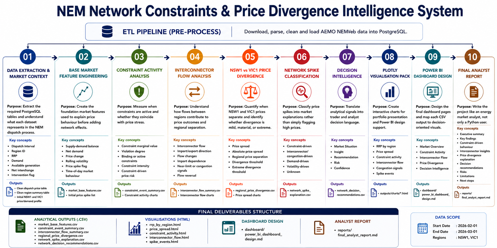

# NEM Network Constraints & Price Divergence Intelligence System

**Prepared by Vivek Bharadwaj - Energy Market Analyst**

This project analyses how **network constraints**, **interconnector flows**, and **regional price separation** influence price outcomes in the Australian National Electricity Market (NEM).

It is designed as a professional Energy Market Analyst portfolio project, combining PostgreSQL data extraction, Python feature engineering, market event classification, Plotly visualisation, and decision-oriented recommendations.

**Live project dashboard:**  
[https://vivekarya05.github.io/nem-network-constraints-price-divergence/](https://vivekarya05.github.io/nem-network-constraints-price-divergence/)

---

## Project Workflow

The project follows an end-to-end market analytics workflow: ETL, PostgreSQL extraction, feature engineering, constraint analysis, interconnector flow analysis, price divergence, spike classification, decision intelligence, visualisation, dashboard design, and final analyst reporting.



---

## Business Question

**How do network constraints and interconnector flows drive price spikes, congestion, and regional price divergence in the NEM?**

The analysis focuses on identifying:

- Price spikes not fully explained by demand alone
- Constraint-driven market behaviour
- Interconnector flow stress and congestion signals
- NSW1 vs VIC1 regional price divergence
- Decision intelligence for market analysts and traders

---

## Market Scope

| Item | Scope |
|---|---|
| Market | Australian National Electricity Market |
| Regions | NSW1 and VIC1 |
| Study period | 1 February 2026 to 1 March 2026 |
| Interval resolution | Dispatch interval level |
| Primary focus | Prices, constraints, interconnector flows, divergence, spike classification |

---

## Data Sources

Data was extracted from a local PostgreSQL database populated through an existing AEMO NEMWeb ETL pipeline.

Core tables:

- `raw.dispatch_price`
- `raw.dispatch_regionsum`
- `raw.dispatch_constraints`
- `raw.interconnector_results`

Optional supporting tables:

- `raw.constraint_rhs`
- `raw.constraint_details`
- `raw.constraint_equations`

The project does **not** use NEMOSIS. Data ingestion is handled through a custom ETL workflow using Python, pandas, requests, BeautifulSoup, SQLAlchemy, psycopg2, Flask, and PostgreSQL.

---

## Analytical Workflow

```text
NEMWeb ETL
  -> PostgreSQL raw tables
  -> Data extraction
  -> Data cleaning
  -> Base market feature engineering
  -> Constraint activity analysis
  -> Interconnector flow analysis
  -> Regional price divergence analysis
  -> Network spike classification
  -> Decision intelligence recommendations
  -> Plotly dashboard and analyst report
```

---

## Notebook Structure

| Notebook | Purpose |
|---|---|
| `01_data_extraction_and_market_context.ipynb` | Extracts dispatch price, demand, constraint, and interconnector data from PostgreSQL and establishes the market context. |
| `02_base_market_feature_engineering.ipynb` | Creates base market features including RRP, demand, available generation, supply-demand gap, price changes, volatility, and spike flags. |
| `03_constraint_activity_analysis.ipynb` | Measures active constraints, marginal values, violation signals, and links constraint activity to price outcomes. |
| `04_interconnector_flow_analysis.ipynb` | Engineers interconnector flow, flow change, high-flow, and congestion signal features. |
| `05_regional_price_divergence.ipynb` | Compares NSW1 and VIC1 prices and calculates price spreads, divergence flags, and extreme divergence events. |
| `06_network_spike_classification.ipynb` | Classifies spike intervals as constraint-driven, interconnector/congestion-driven, demand-driven, volatility-driven, or unknown. |
| `07_decision_intelligence.ipynb` | Converts analytical conditions into market situations, insights, recommendations, risks, and confidence levels. |
| `08_plotly_visualisation_pack.ipynb` | Produces interactive Plotly charts for the project dashboard and reporting pack. |

---

## Feature Engineering

The project creates a structured analytical dataset covering market, network, and decision features.

### Base Market Features

- `rrp`
- `totaldemand`
- `availablegeneration`
- `netinterchange`
- `supply_demand_gap`
- `price_spike_flag`
- `price_change`
- `rolling_volatility`
- Hour, day, and weekday features

### Constraint Features

- `active_constraint_count`
- `max_constraint_marginal_value`
- `total_constraint_marginal_value`
- `violation_flag`
- `max_violation_degree`

### Interconnector Features

- `flow`
- `absolute_flow`
- `flow_change`
- `absolute_flow_change`
- `high_flow_flag`
- `high_flow_change_flag`
- `congestion_signal_flag`

### Price Divergence Features

- NSW1 and VIC1 regional price merge
- `price_spread`
- `absolute_price_spread`
- `divergence_flag`
- `extreme_divergence_flag`

---

## Key Findings

### 1. NSW1 experienced material price spike activity

During the study period, NSW1 recorded **53 price spike intervals above $300/MWh**, while VIC1 did not record comparable spike activity.

This indicates that price stress was regionally concentrated rather than NEM-wide.

### 2. Constraint activity increased during NSW1 spike intervals

NSW1 spike intervals had a higher average active constraint count than non-spike intervals.

However, constraint marginal value and violation evidence showed that not every spike was purely constraint-driven. This is important because it prevents over-attributing price spikes to constraints alone.

### 3. Interconnector stress was present during most NSW1 spike intervals

The analysis found elevated broader interconnector congestion signals during NSW1 spike intervals.

This suggests that network flow conditions and transfer capability played an important role in regional price behaviour, particularly when price stress was isolated to NSW1.

### 4. NSW1 and VIC1 price divergence was meaningful but event-based

The NSW1-VIC1 price spread showed periods of sharp separation, including extreme divergence events. These intervals are analytically important because they highlight when regional prices decouple and local network or supply conditions begin to dominate.

### 5. Spike classification improved the market explanation

NSW1 spike intervals were classified into categories including:

- Constraint-driven
- Interconnector/congestion-driven
- Demand-driven
- Volatility-driven
- Unknown

This converted raw price movements into a more decision-useful market interpretation.

---

## Dashboard

The project includes a GitHub Pages dashboard designed to showcase the analysis in an accessible, portfolio-friendly format.

Dashboard sections include:

- Market overview
- Price and demand comparison
- NSW1 vs VIC1 price spread
- Constraint activity
- Interconnector flow behaviour
- Congestion signals
- Spike classification
- Analyst findings and methodology

Open the dashboard here:

[NEM Network Constraints & Price Divergence Dashboard](https://vivekarya05.github.io/nem-network-constraints-price-divergence/)

---

## Output Tables

Important generated CSV outputs include:

| Output | Description |
|---|---|
| `outputs/02_base_market_features.csv` | Clean base market features by interval and region. |
| `outputs/03_market_features_with_constraints.csv` | Market features enriched with constraint activity signals. |
| `outputs/04_market_features_with_network.csv` | Market and constraint features enriched with interconnector features. |
| `outputs/05_regional_price_divergence.csv` | NSW1 vs VIC1 price spread and divergence flags. |
| `outputs/06_network_spike_explanation.csv` | Spike classification output with explanatory drivers. |
| `outputs/07_network_decision_recommendations.csv` | Decision intelligence recommendations for market conditions. |

---

## Visual Outputs

Interactive Plotly charts are saved in `outputs/charts/`.

Key charts include:

- RRP by region with spike events
- NSW1 vs VIC1 RRP comparison
- NSW1-VIC1 price spread
- Constraint activity vs NSW1 RRP
- VIC1-NSW1 interconnector flow
- Congestion signal count
- Spike classification summary
- Demand and price overview

---

## Reports

The project includes a professional analyst report and a combined visual report.

| Report | File |
|---|---|
| Final analyst report | `reports/final_analyst_report.pdf` |
| Final analyst report markdown | `reports/final_analyst_report.md` |
| Combined visual report | `docs/project_02_combined_visual_report.pdf` |
| NotebookLM slide pack source | `docs/project_02_notebooklm_slide_pack.md` |

---

## Repository Structure

```text
nem-network-constraints-price-divergence/
  index.html
  README.md
  requirements.txt
  notebooks/
  outputs/
    charts/
  reports/
  docs/
  dashboard/
  src/
  mockups/
```

---

## Technology Stack

- Python
- pandas
- numpy
- SQLAlchemy
- psycopg2
- PostgreSQL
- Plotly
- HTML/CSS
- GitHub Pages

---

## How To Run Locally

1. Clone the repository.

```bash
git clone https://github.com/vivekarya05/nem-network-constraints-price-divergence.git
```

2. Move into the project folder.

```bash
cd nem-network-constraints-price-divergence
```

3. Create a `.env` file locally with PostgreSQL credentials.

```text
DB_USER=your_user
DB_PASSWORD=your_password
DB_HOST=localhost
DB_PORT=5432
DB_NAME=your_database
```

4. Install Python dependencies.

```bash
pip install -r requirements.txt
```

5. Run the notebooks in order from `01` to `08`.

6. Open `index.html` locally or visit the hosted GitHub Pages dashboard.

---

## Professional Use Case

This project demonstrates how an energy market analyst can move from raw market data to decision-ready intelligence.

Rather than only reporting price spikes, the analysis asks:

- Was the spike associated with demand conditions?
- Were constraints active at the same time?
- Were interconnector flows showing stress or rapid movement?
- Did NSW1 and VIC1 prices diverge materially?
- What would a trader or analyst need to monitor next?

The final output is designed to support market monitoring, trader briefing, dashboard development, and analyst storytelling.

---

## Author

**Vivek Bharadwaj**  
Energy Market Analyst  

Project focus: Australian NEM analytics, network constraints, price divergence, interconnector flows, decision intelligence, and market modelling.
